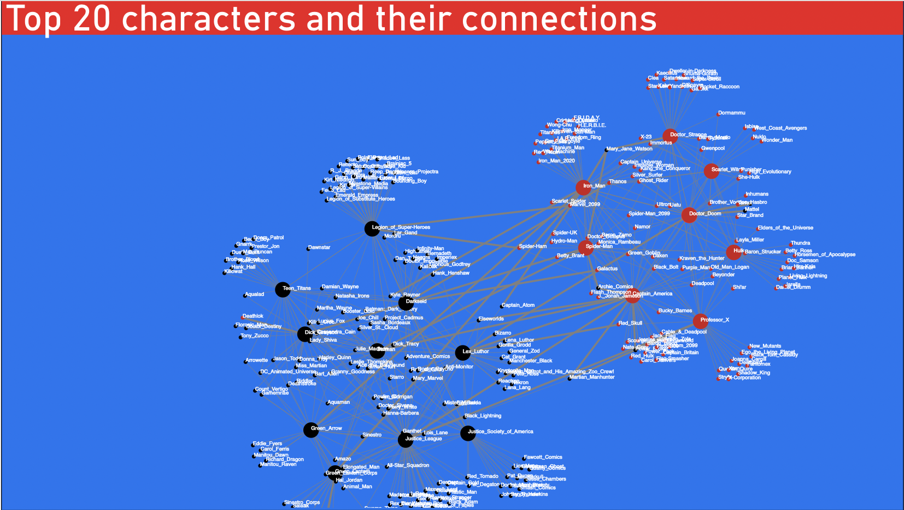

# Comic Universe - Data engineering Case

This project was part of a data engineering recruitment case why the following description: **Transforming Data into Insights**. It should be done in four steps with no information about weight between the different steps
1. Find data in a raw format with potential for transformations
2. Create a cloud provider trail account that can host your project
3. Create an ETL or ELT workflow using multiple technologies (not just python)
4. Visualize the data in an interesting and potentially interactive way (powerBI, Datastudio etc.)

## The project

The project investigates some of the interactions between Mavrvel and DC along some characteristics form the universes

The primary focus is about the data transformation part and to showcase som of the capabilities of the data choosen. The notebook is not completly done, but works almost as intended. Consider it a POC

The powerpoint slides gives a rough idea of the actual presentation of the model, and see screenshots below of the PowerBI report.

**Please check out the code/slides first"

**Page one:** visualising some of tha characteristics of the two networks. Limited to a couple of charaters for each network due to limitations in PowerBI on memory

**Page two:** For looking at specific characters

**Page three:** For investigating 

